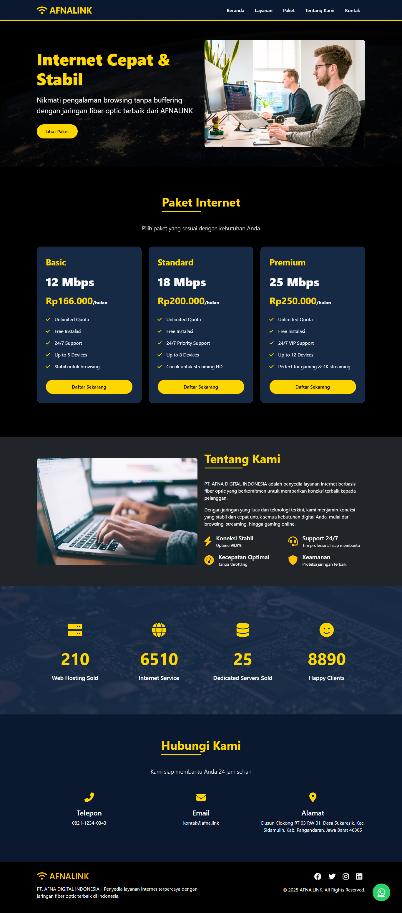
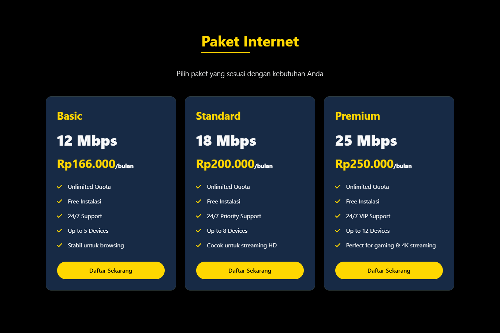
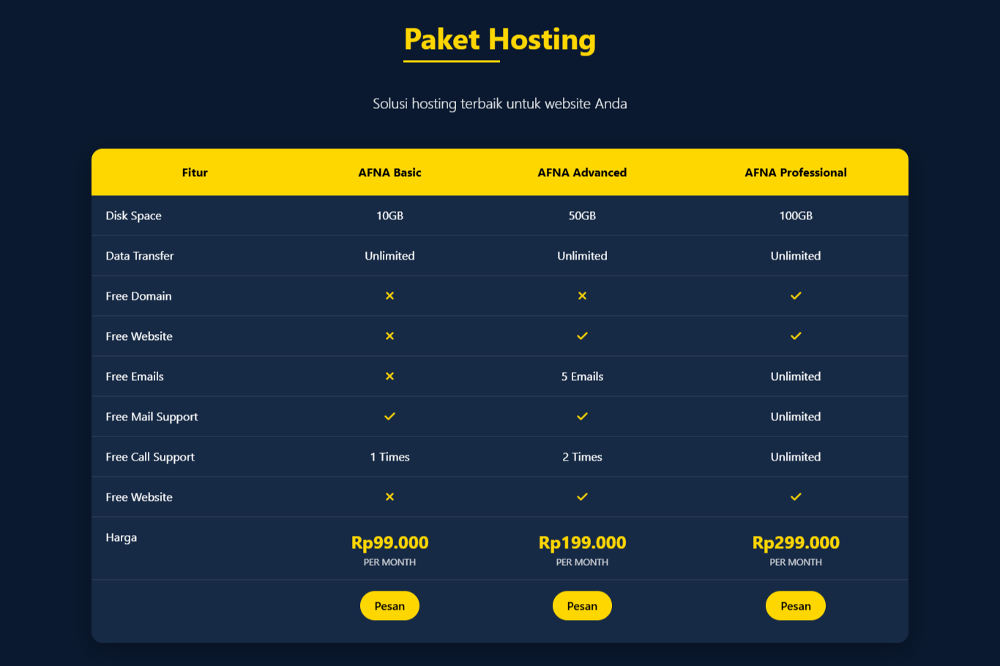

# AFNALINK - Landing Page



Landing page modern untuk PT. AFNA DIGITAL INDONESIA yang menampilkan layanan internet dan hosting dengan desain elegan dan fitur interaktif.

## Fitur Utama

✅ **Desain Responsif** - Tampilan optimal di semua perangkat (desktop, tablet, mobile)  
✅ **Animasi Modern** - Efek scroll, hover, dan counter yang menarik  
✅ **Paket Internet** - Menampilkan 3 paket internet dengan fitur lengkap  
✅ **Paket Hosting** - Tabel perbandingan 3 paket hosting dengan berbagai fitur  
✅ **Statistik Perusahaan** - Counter animasi untuk menampilkan pencapaian  
✅ **Quick Chat WhatsApp** - Tombol mengambang untuk konsultasi cepat  
✅ **Warna Custom** - Kombinasi hitam, biru tua, putih, dan kuning  

## Teknologi Yang Digunakan

- **Bootstrap 5** - Framework CSS untuk layout responsif  
- **Font Awesome** - Library ikon modern  
- **Animate.css** - Library animasi CSS  
- **Vanilla JavaScript** - Untuk interaktivitas dan animasi custom  

## Struktur Halaman

1. **Hero Section** - Introduksi perusahaan dengan CTA  
2. **Statistik** - Pencapaian perusahaan dengan animasi counter  
3. **Paket Internet** - 3 pilihan paket internet (12Mbps, 18Mbps, 25Mbps)  
4. **Paket Hosting** - Tabel perbandingan paket hosting (Basic, Advanced, Professional)  
5. **Tentang Kami** - Profil perusahaan dan keunggulan  
6. **Kontak** - Informasi kontak perusahaan  
7. **Footer** - Informasi hak cipta dan sosial media  

## Cara Menggunakan

1. Clone repository ini:
   ```bash
   git clone https://github.com/username/afnalink.git
   ```

2. Buka file `index.html` di browser favorit Anda

3. Untuk melakukan customisasi:
   - Edit konten langsung di file `index.html`
   - Ubah warna di bagian `:root` dalam `<style>`
   - Update gambar dengan mengganti URL di `background-image`

## Customisasi

Untuk menyesuaikan dengan kebutuhan Anda, Anda dapat mengubah:

- **Nomor WhatsApp**: Ganti di semua link `https://wa.me/6281234567890`
- **Warna**: Ubah variabel CSS di `:root`
- **Konten Paket**: Edit di section terkait
- **Gambar**: Ganti URL gambar di `background-image`

## Preview




## Lisensi

Projek ini dilisensikan dibawah [MIT License](LICENSE).

---

**PT. AFNA DIGITAL INDONESIA**  
Dusun Ciokong RT 03 RW 01, Desa Sukaresik
Kec. Sidamulih, Kab. Pangandaran, Jawa Barat 46365  
Phone: 0821-1234-0343  
Email: kontak@afna.link